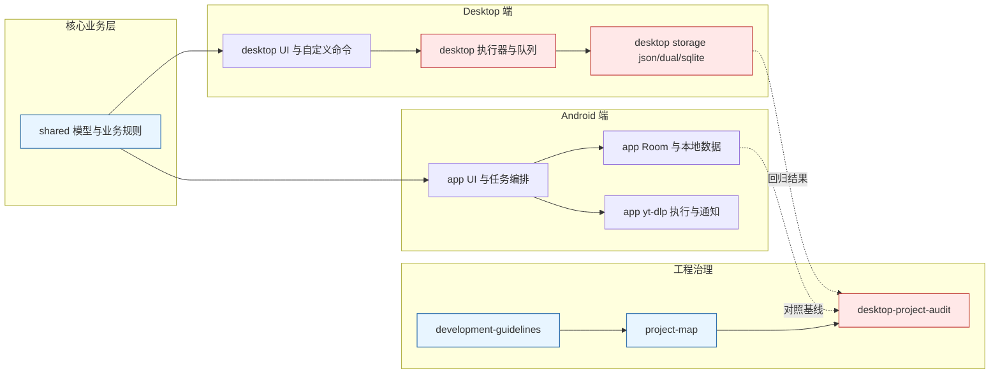

# Seal-Desktop Project Map

> 更新时间：2026-08-12
>
> 本文用于回答三件事：这个项目在做什么、模块在哪里、当前行动清单看哪里。
>
> 当前细粒度缺陷、Android parity、冗余代码和清理任务已经合并到 `docs/desktop-project-audit-2026-06-15.md`。本文只保留项目地图和导航，不再作为缺陷状态的唯一来源。
> 代码操作、模块边界、多语言和验证规范统一由根目录 `AGENTS.md` 与 `docs/development-guidelines.md` 管理。

## Overview
Seal-Desktop 是 Seal 的桌面移植与跨端演进项目：围绕 yt-dlp 下载能力，构建 Android + Desktop 的统一业务模型、可复用下载流程和可持续收尾路线。

## Tech Stack
- 前端：Jetpack Compose（Android）、Compose Multiplatform（Desktop）、Material 3
- 后端：Kotlin、Kotlin Coroutines、yt-dlp 执行编排（Android: youtubedl-android，Desktop: JVM 执行器）
- 数据库/存储：
  - Android：Room (SQLite) + MMKV
  - Desktop：SQLite (xerial) + JSON 兼容层（json/dual/sqlite 三后端）
  - 跨端数据：kotlinx-serialization

## 项目结构地图

| 模块 | 角色 | 关键内容 |
| --- | --- | --- |
| `app/` | Android 产品端 | 下载执行、通知、服务、Room、Android UI |
| `desktop/` | Desktop 产品端 | 下载 UI、自定义命令、设置、存储、进程执行、平台打包 |
| `shared/` | 跨端共享层 | 模型、下载计划、选择合并、平台无关 UI 和契约 |
| `color/` | 主题/色彩支持 | 颜色与视觉支持 |
| `docs/` | 工程治理 | 开发规范、项目地图、缺陷清单、历史记录 |
| `translations/` | 多语言文档 | README 多语种版本 |

当前完成度、缺陷和优先级只在 `docs/desktop-project-audit-2026-06-15.md` 更新，本文不维护百分比或日期计划。

## 模块依赖图

## Modules（按业务域）

### `shared/download/`
- 下载计划与参数拼装能力（平台无关）
- 选择合并（SelectionMerge）与播放列表映射
- 对 Android/Desktop 的执行层提供统一输入

### `desktop/download/`
- Desktop 下载队列、状态管理、执行控制
- 与下载配置页联动（普通下载 + 命令模式）

### `desktop/customcommand/`
- 自定义命令模板、任务管理、日志视图
- 任务快照落盘与重启恢复（当前语义：Running -> Canceled）

### `desktop/storage/`
- 三后端存储（json/dual/sqlite）
- 原子写、损坏隔离、事件日志、自检任务

### `app/download/` + `app/util/`
- Android 任务编排、服务保活、通知动作、平台能力集成
- 作为 Desktop 对齐的参照实现

### `app/database/`
- Room 实体、DAO、迁移链路
- 提供 Android 结构化存储能力

## Key Flows

### 1. 普通下载流程
`页面输入 URL -> 拉取元数据 -> 选择格式/偏好 -> 生成 DownloadPlan -> 平台执行器执行 -> 队列状态更新 -> 历史持久化 -> 通知反馈`

### 2. 自定义命令流程（Desktop）
`选择模板 -> 输入 URL -> DesktopCustomCommandTaskManager 启动任务 -> 实时日志/进度 -> 完成或失败通知 -> 任务快照持久化`

### 3. 存储后端流程（Desktop）
`状态变更 -> (json/dual/sqlite) 写入策略 -> 原子写/SQLite 写入 -> 事件日志 -> 重启恢复`

### 4. 跨端共享流程
`Android 资源/业务规则 -> shared 模型与逻辑 -> app/desktop 各自适配执行`

## 关键代码入口

| 场景 | 入口 |
| --- | --- |
| Desktop 应用和窗口生命周期 | `desktop/src/main/kotlin/com/junkfood/seal/desktop/Main.kt` |
| Desktop 下载调度 | `desktop/src/main/kotlin/com/junkfood/seal/desktop/download/DesktopDownloadController.kt` |
| Desktop 依赖来源解析 | `desktop/src/main/kotlin/com/junkfood/seal/desktop/ytdlp/DesktopDependencyResolver.kt` |
| 跨端下载计划 | `shared/src/commonMain/kotlin/com/junkfood/seal/download/DownloadPlanFactory.kt` |
| Desktop 设置状态 | `desktop/src/main/kotlin/com/junkfood/seal/desktop/settings/DesktopSettingsState.kt` |
| Android 语言选项 | `app/src/main/java/com/junkfood/seal/util/LanguageSettings.kt` |
| Desktop 语言映射 | `desktop/src/main/kotlin/com/junkfood/seal/desktop/i18n/DesktopLocaleOptions.kt` |
| 产品字符串事实源 | `app/src/main/res/values*/strings.xml` |

变更任务模板、Definition of Done 和验证矩阵见 `docs/development-guidelines.md`，当前任务排序见审计文档。

## 关联文档
- `AGENTS.md`（每次代码操作必须先读的边界与最低验证要求）
- `docs/development-guidelines.md`（模块、parity、i18n、依赖、存储和验证详细规范）
- `docs/desktop-project-audit-2026-06-15.md`（当前唯一行动清单：缺陷、parity、冗余代码、清理策略）
- `docs/android-desktop-progress-tracker.md`（2026-04 历史基线，保留迁移过程与早期决策）
