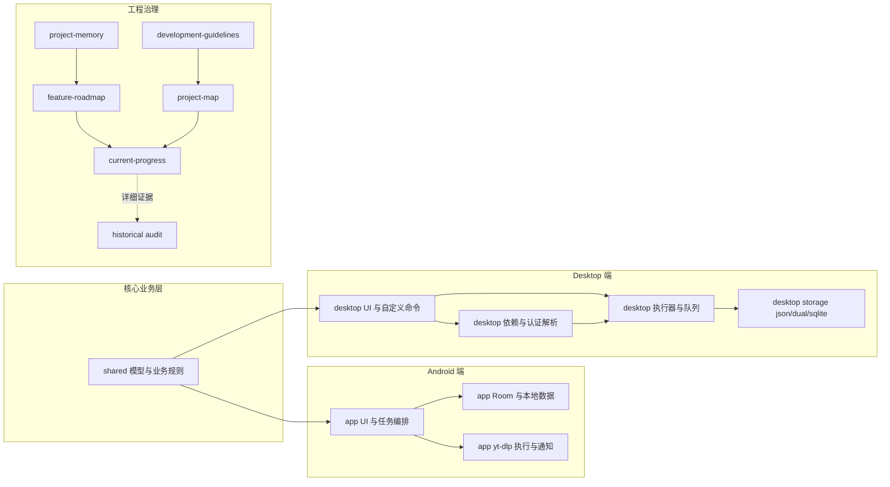

# Seal-Desktop Project Map

> 更新时间：2026-09-28
>
> 本文用于回答三件事：这个项目在做什么、模块在哪里、当前行动清单看哪里。
>
> 当前恢复点、优先级和验证债统一维护在 `docs/current-progress.md`；长期项目事实与关键决策维护在 `docs/project-memory.md`；“这是 Bug 还是尚未完成的规划能力”由 `docs/feature-roadmap.md` 统一定义。旧的 `docs/desktop-project-audit-2026-06-15.md` 保留详细历史证据和长清单，不再作为新 Agent 的第一入口。
> 代码操作、模块边界、多语言、Agent 工作模式和验证规范统一由根目录 `AGENTS.md`、`docs/agent-workflow.md` 与 `docs/development-guidelines.md` 管理。

## Overview
Seal-Desktop 是 Seal 的桌面移植与跨端演进项目：围绕 yt-dlp 下载能力，构建 Android + Desktop 的统一业务模型、可复用下载流程和可持续收尾路线。

## Tech Stack
- 前端：Jetpack Compose（Android）、Compose Multiplatform（Desktop）、Material 3
- 后端：Kotlin、Kotlin Coroutines、yt-dlp 执行编排（Android: youtubedl-android，Desktop: JVM 执行器）
- 数据库/存储：
  - Android：Room (SQLite) + MMKV
  - Desktop：queue/history/app-settings 使用 SQLite (xerial) + JSON 兼容层（json/dual/sqlite 三后端）；`DownloadPreferences` 暂时仍使用独立 `settings.json`
  - 跨端数据：kotlinx-serialization

## 项目结构地图

| 模块 | 角色 | 关键内容 |
| --- | --- | --- |
| `app/` | Android 产品端 | 下载执行、通知、服务、Room、Android UI |
| `desktop/` | Desktop 产品端 | 下载 UI、自定义命令、设置、存储、进程执行、平台打包 |
| `shared/` | 跨端共享层 | 模型、下载计划、选择合并、平台无关 UI 和契约 |
| `color/` | 主题/色彩支持 | 颜色与视觉支持 |
| `docs/` | 工程治理 | 项目记忆、功能路线图、当前进度、开发规范、项目地图、历史审计 |
| `translations/` | 多语言文档 | README 多语种版本 |

当前工作优先级只在 `docs/current-progress.md` 更新；产品能力状态只在 `docs/feature-roadmap.md` 更新；本文不维护百分比或日期计划。

## 模块依赖图

```mermaid
flowchart LR
  subgraph Core[核心业务层]
    Shared[shared 模型与业务规则]
  end

  subgraph Android[Android 端]
    AppUI[app UI 与任务编排]
    AppDB[app Room 与本地数据]
    AppExec[app yt-dlp 执行与通知]
  end

  subgraph Desktop[Desktop 端]
    DUI[desktop UI 与自定义命令]
    DExec[desktop 执行器与队列]
    DDeps[desktop 依赖与认证解析]
    DStore[desktop storage json/dual/sqlite]
  end

  subgraph Docs[工程治理]
    Memory[project-memory]
    Roadmap[feature-roadmap]
    Current[current-progress]
    Guide[development-guidelines]
    PMAP[project-map]
    Audit[historical audit]
  end

  Shared --> AppUI
  Shared --> DUI

  AppUI --> AppExec
  AppUI --> AppDB

  DUI --> DExec
  DUI --> DDeps
  DDeps --> DExec
  DExec --> DStore

  Memory --> Roadmap
  Roadmap --> Current
  Guide --> PMAP
  PMAP --> Current
  Current -.详细证据.-> Audit
```

## Modules（按业务域）

### `shared/download/`
- 下载计划与参数拼装能力（平台无关）
- 选择合并（SelectionMerge）与播放列表映射
- 对 Android/Desktop 的执行层提供统一输入

### `desktop/download/`
- Desktop 下载队列、状态管理、执行控制
- 与下载配置页联动（普通下载 + 命令模式）

### `desktop/customcommand/`
- 自定义命令模板、任务管理、日志视图
- 任务快照落盘与重启恢复（当前语义：Running -> Interrupted）

### `desktop/storage/`
- queue/history/app-settings 三后端存储（json/dual/sqlite）
- 原子写、损坏隔离、事件日志、自检任务
- 下载偏好当前由 `DesktopSettingsState` 单独写 `settings.json`，尚未纳入三后端

### `desktop/ytdlp/` + `desktop/network/`
- system/selfhost/packaged/auto 依赖解析、平台路径和辅助工具下载
- yt-dlp/ffmpeg 执行配置、metadata 获取、Cookies 文件和 proxy 运行环境
- 当前重点缺口：认证上下文未贯通 metadata 与下载；依赖已区分 Missing/Healthy/Broken，但原生多平台 smoke 证据仍待补齐

### `app/download/` + `app/util/`
- Android 任务编排、服务保活、通知动作、平台能力集成
- 作为 Desktop 对齐的参照实现

### `app/database/`
- Room 实体、DAO、迁移链路
- 提供 Android 结构化存储能力

## Key Flows

### 1. 普通下载流程
`页面输入 URL -> 拉取元数据 -> 选择格式/偏好 -> 生成 DownloadPlan -> 平台执行器执行 -> 队列状态更新 -> 历史持久化 -> 通知反馈`

### 2. Desktop Cookies 目标流程
`已登录的系统浏览器或外部 Netscape 文件 -> 解析统一认证上下文 -> metadata/格式页/正式下载/自定义命令/重试 -> 失败/状态反馈`

Desktop 不复制 Android 内嵌 WebView 登录机制，详见 `docs/feature-roadmap.md`。
浏览器提取是主入口，文件导入是 fallback；当前认证上下文尚未贯通全部请求。

### 3. 自定义命令流程（Desktop）
`选择模板 -> 输入 URL -> DesktopCustomCommandTaskManager 启动任务 -> 实时日志/进度 -> 完成或失败通知 -> 任务快照持久化`

### 4. 存储后端流程（Desktop）
`状态变更 -> (json/dual/sqlite) 写入策略 -> 原子写/SQLite 写入 -> 事件日志 -> 重启恢复`

### 5. 跨端共享流程
`Android 资源/业务规则 -> shared 模型与逻辑 -> app/desktop 各自适配执行`

### 6. Desktop 依赖与打包流程
`环境偏好(system/selfhost/auto) -> resolver -> health/source 状态 -> 执行器或环境修复 UI`

`Lite: 应用运行时 -> smoke`；`Full: 显式准备平台工具 -> 注入 appResources -> 打包 -> staged/installed tool smoke`。普通本地打包不会自动变成 Full。

## 关键代码入口

| 场景 | 入口 |
| --- | --- |
| Desktop 应用和窗口生命周期 | `desktop/src/main/kotlin/com/junkfood/seal/desktop/Main.kt` |
| Desktop 下载调度 | `desktop/src/main/kotlin/com/junkfood/seal/desktop/download/DesktopDownloadController.kt` |
| Desktop 依赖来源解析 | `desktop/src/main/kotlin/com/junkfood/seal/desktop/ytdlp/DesktopDependencyResolver.kt` |
| Desktop 依赖安装与 Full 工具来源 | `desktop/src/main/kotlin/com/junkfood/seal/desktop/ytdlp/DesktopAuxiliaryDownloader.kt`、`.github/workflows/*_portable.yml` |
| Desktop metadata 获取 | `desktop/src/main/kotlin/com/junkfood/seal/desktop/ytdlp/YtDlpMetadataFetcher.kt` |
| Desktop Cookies UI 与全局文件 | `desktop/src/main/kotlin/com/junkfood/seal/desktop/settings/network/CookiesSettingsPage.kt`、`DesktopYtDlpPaths.kt` |
| Desktop 队列快照 | `desktop/src/main/kotlin/com/junkfood/seal/desktop/download/DesktopDownloadQueueStorage.kt` |
| 跨端下载计划 | `shared/src/commonMain/kotlin/com/junkfood/seal/download/DownloadPlanFactory.kt` |
| Desktop 设置状态 | `desktop/src/main/kotlin/com/junkfood/seal/desktop/settings/DesktopSettingsState.kt` |
| Android 语言选项 | `app/src/main/java/com/junkfood/seal/util/LanguageSettings.kt` |
| Desktop 语言映射 | `desktop/src/main/kotlin/com/junkfood/seal/desktop/i18n/DesktopLocaleOptions.kt` |
| 产品字符串事实源 | `app/src/main/res/values*/strings.xml` |

变更任务模板、Definition of Done 和验证矩阵见 `docs/development-guidelines.md`，Agent 迭代/人工核对规则见 `docs/agent-workflow.md`，产品能力状态见 `docs/feature-roadmap.md`，当前任务排序见 `docs/current-progress.md`。

## 关联文档
- `AGENTS.md`（每次代码操作必须先读的边界、分类、模式与最低验证要求）
- `docs/project-memory.md`（长期项目事实、关键决策和反复踩坑点）
- `docs/feature-roadmap.md`（规划能力、Partial/Planned/Bug/Decision needed 分类）
- `docs/current-progress.md`（当前恢复点、任务优先级和验证债）
- `docs/agent-workflow.md`（自我迭代模式与人工核对模式）
- `docs/development-guidelines.md`（模块、parity、i18n、依赖、存储和验证详细规范）
- `docs/desktop-project-audit-2026-06-15.md`（历史审计与详细证据，不再作为第一入口）
- `docs/android-desktop-progress-tracker.md`（2026-04 历史基线，保留迁移过程与早期决策）
